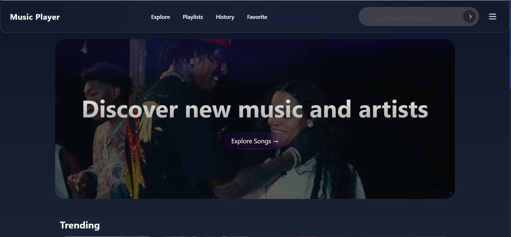

# 🎵 Music Mania

A modern music streaming application built with Next.js, React, and Tailwind CSS. Enjoy a seamless music experience with a beautiful, responsive interface.



## ✨ Features

- 🎧 Stream your favorite music
- 🔍 Discover new tracks and artists
- 📱 Responsive design for all devices
- ⚡ Fast and smooth performance
- 🔄 Offline support (PWA)
- 🎨 Beautiful dark theme
- 🔒 Secure user authentication

## 🚀 Getting Started

### Prerequisites

- Node.js 16.14.0 or later
- npm 8.3.0 or later

### Installation

1. Clone the repository:

   ```bash
   git clone https://github.com/yourusername/music-mania.git
   cd music-mania
   ```

2. Install dependencies:

   ```bash
   npm install
   # or
   yarn install
   ```

3. Set up environment variables:
   Create a `.env.local` file in the root directory and add the following:

   ```env
   NEXT_PUBLIC_API_URL=your_api_url_here
   JWT_SECRET=your_jwt_secret_here
   YOUTUBE_API_KEY=your_youtube_api_key_here
   ```

4. Run the development server:

   ```bash
   npm run dev
   # or
   yarn dev
   ```

5. Open [http://localhost:3000](http://localhost:3000) with your browser to see the result.

## 🛠 Built With

- [Next.js](https://nextjs.org/) - The React Framework
- [React](https://reactjs.org/) - A JavaScript library for building user interfaces
- [Tailwind CSS](https://tailwindcss.com/) - A utility-first CSS framework
- [Radix UI](https://www.radix-ui.com/) - Unstyled, accessible components
- [Redux Toolkit](https://redux-toolkit.js.org/) - State management
- [Axios](https://axios-http.com/) - Promise based HTTP client

## 📱 Progressive Web App

Music Mania is a PWA, which means you can install it on your device for an app-like experience. Look for the install prompt in your browser.

## 🧪 Testing

Run the test suite:

```bash
npm test
# or
yarn test
```

## 📦 Building for Production

To create a production build:

```bash
npm run build
# or
yarn build
```

## 🤝 Contributing

Contributions are what make the open source community such an amazing place to learn, inspire, and create. Any contributions you make are **greatly appreciated**.

1. Fork the Project
2. Create your Feature Branch (`git checkout -b feature/AmazingFeature`)
3. Commit your Changes (`git commit -m 'Add some AmazingFeature'`)
4. Push to the Branch (`git push origin feature/AmazingFeature`)
5. Open a Pull Request

## 📄 License

Distributed under the MIT License. See `LICENSE` for more information.

## 📧 Contact

Your Name - [@your_twitter](https://twitter.com/your_username) - your.email@example.com

Project Link: [https://github.com/yourusername/music-mania](https://github.com/yourusername/music-mania)

## 🙏 Acknowledgments

- [Next.js Documentation](https://nextjs.org/docs)
- [React Documentation](https://reactjs.org/)
- [Tailwind CSS Documentation](https://tailwindcss.com/docs)
- [Best README Template](https://github.com/othneildrew/Best-README-Template)
